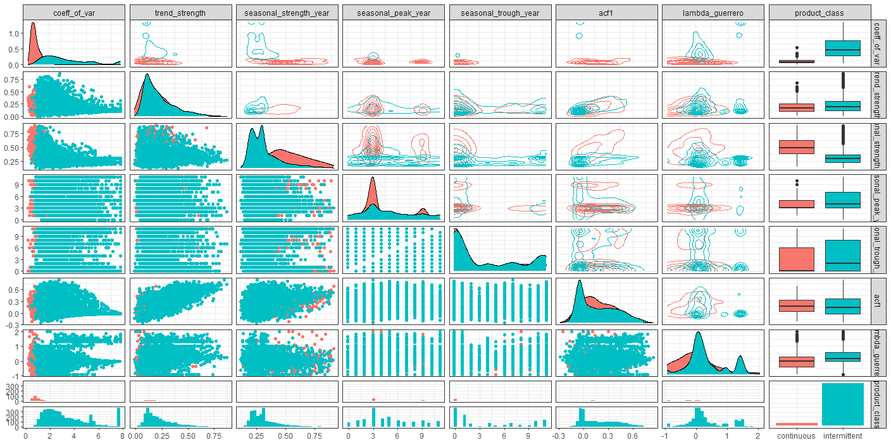

# [AIPlan4EU](https://www.aiplan4eu-project.eu/)

**INTELLIGENT SALES, INVENTORY AND OPERATIONS PLANNING - ISIOP project**, represents the winning project in the *1st Open-call for innovators submitted in Track B*, for the cascadilly funded **Horizon 2020** project **AIPlan4EU**.

Lead researches:

* PhD [Dejan Mircetic](https://www.linkedin.com/feed/update/urn:li:activity:6993199240374050816/)
* PhD [Slobodan Ilic](https://www.linkedin.com/posts/ai-institute-serbia_computervision-meet-ouriaicrew-activity-6965975239239311360-i4UL?utm_source=share&utm_medium=member_desktop)
* PhD [Marinko Maslaric](https://www.linkedin.com/in/marinko-maslaric-6058576/)

The partners on this project:

* [Artificial Intelligence R&D Institute of Serbia](https://www.ivi.ac.rs/) and
* [Agromarket company](https://www.agromarket.rs/).

There is a lot of job in front of us (*three Sprints + Demo*), let's get do it. Updates coming soon...

# Sprint 1 findings...

 
